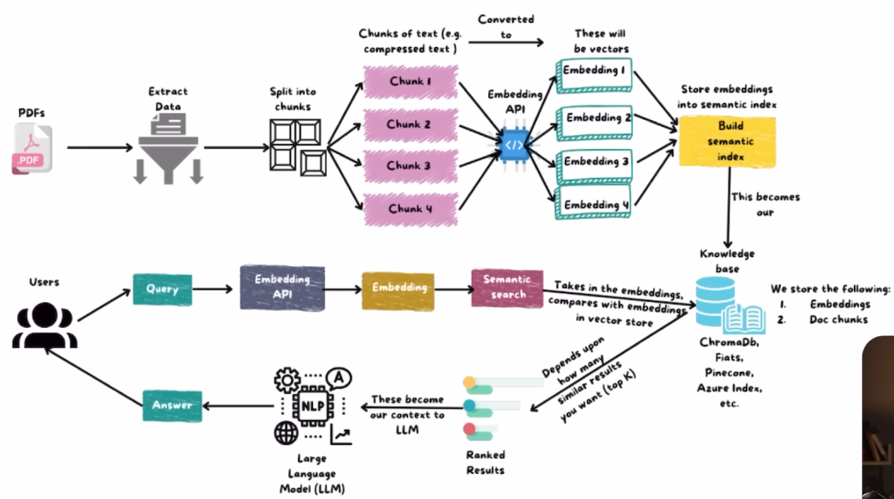

# Multi-Document RAG Chatbot

## Overview

A multi-document Retrieval-Augmented Generation (RAG) chatbot: upload PDF, HTML, or text documents, then chat with an AI that answers questions grounded in those documents. Ingestion runs as a background job with live progress, retrieval uses hybrid search (dense vectors + PostgreSQL full-text) with optional cross-encoder reranking, and generation is constrained to the retrieved context so the model refuses rather than guesses. Chat sessions and messages persist across restarts and are browsable in the UI. The stack is FastAPI + Streamlit on the front, Postgres/pgvector for storage, local sentence-transformers for embeddings and reranking, and Groq for answer generation.

## Setup

### Requirements

- Python **3.11** (see `runtime.txt`; newer 3.x should work — this repo was also verified on 3.13)
- A Postgres database with the **pgvector** extension (e.g. [Neon](https://neon.tech) free tier)
- A [Groq](https://console.groq.com) API key

### Install

```bash
python -m venv venv

# Windows
venv\Scripts\activate

# macOS / Linux
source venv/bin/activate

pip install -r requirements.txt
```

### Environment variables

Copy the example file and fill in real values:

```bash
cp .env.example .env
```

| Variable | Purpose |
|---|---|
| `POSTGRES_HOST`, `POSTGRES_PORT`, `POSTGRES_DB`, `POSTGRES_USER`, `POSTGRES_PASSWORD`, `POSTGRES_SSLMODE` | Fallback DB settings for the API/CLI when no UI connection is active |
| `GROQ_API_KEY` | Groq API key (required for generation) |
| `GROQ_MODEL` | Groq model id (`.env.example` sets `openai/gpt-oss-120b`) |
| `EMBEDDING_MODEL` | Local embedding model (default `BAAI/bge-small-en-v1.5`) |
| `EMBEDDING_DIMENSION` | Embedding vector size (default `384`) |
| `VECTOR_TABLE` | Chunk table name (default `document_chunks`) |
| `QUERY_TOP_K` | Default retrieval depth (default `5`) |

Notes:

- The **Streamlit UI has its own connection screen** (Postgres connection string + Groq key/model). Values entered there override `.env` at runtime and are cached in `.streamlit_connection.json`. `.env` still matters for the FastAPI backend and any scripts run outside the UI.
- The database must have pgvector enabled: `CREATE EXTENSION IF NOT EXISTS vector;`

### Run

Start the FastAPI backend (serves `/api/*` and `/health`; tables are auto-created on startup — no manual migration step):

```bash
uvicorn app.main:app --reload --port 8000
```

Start the Streamlit UI (separate terminal, same venv):

```bash
streamlit run app/ui/streamlit_app.py
```

On first UI load, paste your Postgres connection string and Groq API key, click **Connect**, then use the **Ingest Documents** page to upload files and the **Chat** page to ask questions. All DB tables (`document_chunks`, `chat_sessions`, `chat_messages`) are created automatically on startup and on connect.

## Tech Stack

| Layer | Technology |
|---|---|
| Backend API | FastAPI `0.115.0`, Uvicorn `0.30.6`, Pydantic `2.9.2` |
| UI | Streamlit `1.39.0` |
| Vector + relational DB | PostgreSQL + pgvector `0.2.5` (Neon or self-hosted) |
| ORM / driver | SQLAlchemy `2.0.35`, psycopg `3.x` (`psycopg[binary]>=3.2.2`) |
| Embeddings | `BAAI/bge-small-en-v1.5` via sentence-transformers `3.2.1` (local, 384-dim) |
| Reranking | `BAAI/bge-reranker-base` CrossEncoder via sentence-transformers (local) |
| LLM | Groq API (`groq==0.13.0`) — model configured as `GROQ_MODEL`; `.env.example` / UI use `openai/gpt-oss-120b` |
| Document parsing | PyMuPDF (PDF), BeautifulSoup4 `4.12.3` (HTML) |
| Tokenization / chunking | tiktoken `0.8.0` (cl100k_base) |
| Misc | python-dotenv `1.0.1`, python-multipart `0.0.20`, torch `>=2.6.0`, transformers `4.45.2` |

Exact pins are in `requirements.txt`.

## Architecture


Ingestion — Uploaded files go to a temp directory (never persisted to disk) → text extracted (PyMuPDF for PDF, BeautifulSoup for HTML) → chunked using one of four strategies (fixed, sentence_aware, paragraph_based, recursive) → embedded locally (sentence-transformers) → stored in Postgres via pgvector. The temp file is deleted immediately after, success or failure. UI uploads run in a background process with live progress; the API endpoint ingests synchronously.

Retrieval — Every query searches all ingested documents via hybrid search: vector similarity and PostgreSQL full-text search run in parallel and merge via Reciprocal Rank Fusion. An optional cross-encoder reranking step (bge-reranker-base) can refine the top results further.

Generation — Retrieved chunks are passed to Groq with instructions to answer only from that context, or say so if the answer isn't present. Low temperature keeps answers grounded.

Note: Chat history is currently not sent to the LLM — each message is answered independently. Conversation history is still saved and browsable (see below); the plumbing to re-enable it exists but is switched off for now.

Chat sessions — Conversations persist in Postgres (chat_sessions, chat_messages), auto-titled from the first question, and survive restarts.

## AI Usage

This project was built with AI-assisted development (Codex/OpenCode) for implementation, debugging, and refactoring, guided by manual architecture decisions and verification throughout.

At runtime, the app itself uses AI for:

Answer generation — a Groq-hosted LLM answers questions from retrieved context.
Embeddings & reranking — run locally via sentence-transformers, no external API calls.

## Assumptions & Limitations

No authentication — one shared knowledge base; anyone with access sees everything.
Single-turn chat — history is saved but not fed back into the LLM (by design, for now).
File support — PDF, HTML, TXT (+ MD, RTF via API). Hard 50MB limit enforced by Streamlit (`maxUploadSize` in `.streamlit/config.toml`).
Single Postgres instance — no sharding or high-concurrency pooling.
Local embeddings/reranking — CPU-bound unless a GPU torch build is installed; first run downloads model weights.
No rate limiting — the API has no abuse protection or quotas.
Synchronous API ingestion — POST /api/ingest blocks until done; the UI uses a background worker instead.
